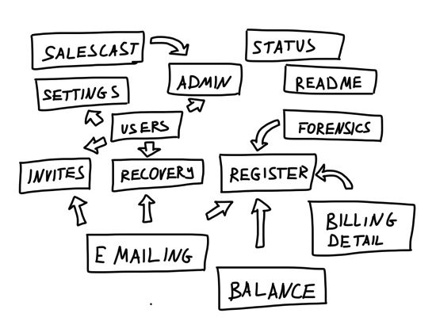
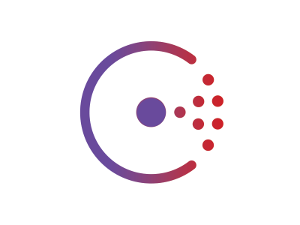
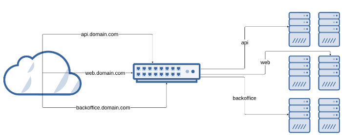
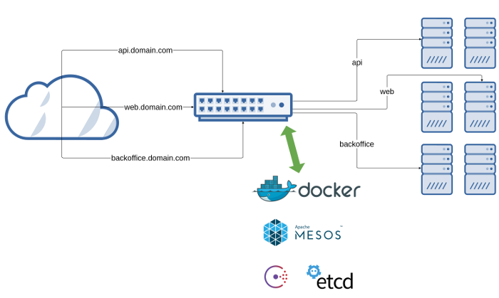

name: inverse
layout: true
class: center, middle, inverse
---

Emile Vauge
---
layout: false
class: center, middle
# DevOps

.bottom[
<i class="fa fa-twitter fa-2x"></i> [@emilevauge](http://twitter.com/emilevauge)

<i class="fa fa-github fa-2x"></i> [emilevauge/traefik](https://github.com/emilevauge/traefik)
]

---
class: center, middle, inverse
# Why ?

---
class: center, middle
## Microservices

---
class: center, middle
## Containers

---
class: center, middle
## Orchestration

---
class: center, middle
## Service discovery

---
class: center, middle, inverse
# Here comes

---
class: center, middle
## Reverse proxy

---
class: center, middle
## Traefik

---
.left-column[
  ## Features
]
.right-column[
<i class="fa fa-check-square"></i> Single binary

<i class="fa fa-check-square"></i> Rest API, metrics

<i class="fa fa-check-square"></i> Multiple backends supported: Docker, Mesos/Marathon, Consul, Etcd, and more to come

<i class="fa fa-check-square"></i> Watchers for backends

<i class="fa fa-check-square"></i> Hot-reloading of configuration. No need to restart the process

<i class="fa fa-check-square"></i> Graceful shutdown http connections during hot-reloads

<i class="fa fa-check-square"></i> Circuit breakers on backends

<i class="fa fa-check-square"></i> Weighted Round Robin, Dynamic Round Robin load-balancers

<i class="fa fa-check-square"></i> Tiny docker image included

<i class="fa fa-check-square"></i> WebUI
]
---

.left-column[
  ## Plumbing
]
.right-column[
<i class="fa fa-check-square"></i> Oxy: an awsome proxy library made by Mailgun guys

<i class="fa fa-check-square"></i> Gorilla mux: famous request router

<i class="fa fa-check-square"></i> Negroni: web middlewares made simple

<i class="fa fa-check-square"></i> Manners: graceful shutdown of http.Handler servers

<i class="fa fa-check-square"></i> Viper/Cobra: Configuration and command line from @spf13
]

---
class: center, middle, inverse
# Demo

---
class: center, middle
<iframe src="https://ghbtns.com/github-btn.html?user=emilevauge&repo=traefik&type=star&count=true&size=large" frameborder="0" scrolling="0" width="160px" height="30px"></iframe>

---
class: center, middle

##Mantl from Cisco Cloud

##Apollo from Cap Gemini

---
class: center, middle, inverse

